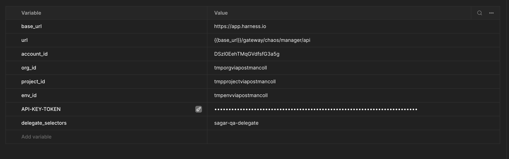

# Harness Chaos Engineering API Collection

[](LICENSE)
[](https://www.postman.com/harness-chaos-engineering/workspace/harness-chaos-engineering-public/overview)
[](CONTRIBUTING.md)
[](https://github.com/sagarkrsd/Harness-Chaos-Engineering-APIs/stargazers)

> Comprehensive Postman collection for interacting with Harness Chaos Engineering APIs

## Table of Contents

- [Features](#features)
- [Prerequisites](#prerequisites)
- [Quick Start](#quick-start)
- [API Reference](#api-reference)
- [Examples](#examples)
- [Contributing](#contributing)
- [Support](#support)
- [License](#license)

## Features

- **Complete API Coverage**: All Harness Chaos Engineering endpoints
- **Multiple Environments**: Sample environments for QA and Production
- **Example Flows**: Common workflows and use cases
- **Comprehensive Documentation**: Detailed guides and references

## Prerequisites

Before you begin, ensure you have the following:

- [Postman](https://www.postman.com/downloads/) v11.42.3 or later
- Active [Harness Account](https://app.harness.io)
- Required permissions in your Harness account
- API key with appropriate permissions
- Node.js 14+ (for running tests and scripts)

## Quick Start

### 1. Clone the Repository

```bash
git clone https://github.com/sagarkrsd/Harness-Chaos-Engineering-APIs.git
cd Harness-Chaos-Engineering-APIs
```

### 2. Import the Collection

#### Using Postman Desktop (Recommended)

1. Open Postman
2. Click "Import" > "File"
3. Select the collection file from `postman/collections/`
4. Click "Import"

#### Using Postman Web

1. Visit [Harness Chaos Engineering Public Workspace](https://www.postman.com/harness-chaos-engineering/harness-chaos-engineering-public/overview).
2. Click on the postman collection you want to use such as [Harness Chaos Engineering APIs - REST](https://www.postman.com/harness-chaos-engineering/harness-chaos-engineering-public/collection/lwhho9j/harness-chaos-engineering-apis-rest).
3. Click "Fork" to add to your workspace.
4. Select your personal workspace and confirm.

### 3. Set Up Environment

1. Import the appropriate environment file from `postman/environments/` directory:
   - `QA.postman_environment.json` for testing
   - `Prod1.postman_environment.json` for production

#### Using Postman Desktop (Recommended)

    - Open Postman
    - Click "Import" > "File"
    - Select the environment file from `postman/environments/`
    - Click "Import"

#### Using Postman Web

    - Visit [Harness Chaos Engineering Public Workspace](https://www.postman.com/harness-chaos-engineering/harness-chaos-engineering-public/overview).
    - Click on the postman environment you want to use such as [Prod1](https://www.postman.com/harness-chaos-engineering/harness-chaos-engineering-public/environment/25469526-8c7108fd-9f36-4d0f-83f4-80c63e4ba474).
    - Click "Fork" to add to your workspace.
    - Select your personal workspace and confirm.

2. Update environment variables:

| Variable Name        | Description                     |
| -------------------- | ------------------------------- |
| `base_url`           | The base URL for the API        |
| `url`                | The URL for the API             |
| `account_id`         | Your Harness account ID         |
| `org_id`             | Your Harness organization ID    |
| `project_id`         | Your Harness project ID         |
| `env_id`             | Your Harness environment ID     |
| `delegate_selectors` | Your Harness delegate selectors |
| `API-KEY-TOKEN`      | Your API key token              |

Let's break down the variables:

- `base_url` & `url`

  **NOTE: If you are using chaos postman collection provided by Harness, this value will be pre-filled under postman variables section:**
  - `base_url` -> <https://app.harness.io>
  - `url` -> {{base_url}}/gateway/chaos/manager/api/query

  This is the Harness Chaos Engineering server URL serving the Chaos API requests.

  | Environment | API Type | API Server URL                                           | Description                                                 |
  | ----------- | -------- | -------------------------------------------------------- | ----------------------------------------------------------- |
  | Prod        | REST     | <https://app.harness.io/gateway/chaos/manager/api>       | The base URL for the Harness Chaos Engineering REST APIs    |
  | Prod        | GRAPHQL  | <https://app.harness.io/gateway/chaos/manager/api/query> | The base URL for the Harness Chaos Engineering GraphQL APIs |

- `project_id`

  This is your Harness project ID. Please use the project where you would like to run Chaos experiments.

  You can retrieve your project ID by following the below steps:
  - Go to `Projects` in [Harness](https://app.harness.io/).
  - Select the project where you would like to run the Chaos experiments or create a new project.
  - Click on `Overview`.
  - Copy the value of `Id`.

  **NOTE:** Please make sure to copy the value of `Organization` as well, this will be the value of next required variable `org_id`.

- `org_id`

  This is your Harness organization ID. Please use the organization where you would like to run Chaos experiments.

  You can retrieve your organization ID by following the below steps:
  - See above step to retrieve project_id - you would have copied the value of org_id as well in that step, if not please follow the same steps again to retrieve organization ID.

- `API-KEY-TOKEN`

  You can use an existing Harness API key token of the same Harness account selected in above steps or you can create a new one by following the below steps:
  - Click on MY PROFILE in [Harness](https://app.harness.io/).
  - Go to My API Keys section and click on `+ API Key` button to create a new API Key.
  - Enter a Name for the API Key (optional Description/Tags) and click on Save.
  - Under the newly created API Key, click on `+ Token` button to generate a new token for this API Key.
  - Enter the Name and select the Expiration(time for which this token will be valid) and click on Generate Token.
  - Please make sure to copy the value of the token generated and store somewhere safe, you may not be able to copy this later.

An updated environment file could look like this screenshot:


### 4. Run Your First Request

1. Open the [Harness Chaos Engineering APIs - REST](https://www.postman.com/harness-chaos-engineering/harness-chaos-engineering-public/collection/lwhho9j/harness-chaos-engineering-apis-rest) in Postman.
2. Select the environment you want to use (e.g., QA or Prod).
3. Select the request you want to run (e.g., [GET /rest/v2/experiment](https://www.postman.com/harness-chaos-engineering/harness-chaos-engineering-public/request/gcj0m71/get-list-of-chaos-v2-experiments?ctx=code)).
4. Update the `required variables, headers, body, etc.` for the request if any.
5. Click `Send` to run the request.
6. You should see the response in the response tab.

## API Reference

The postman collection includes comprehensive documentation for all endpoints.

To view complete documentation:

1. Open the [Harness Chaos Engineering APIs - REST](https://www.postman.com/harness-chaos-engineering/harness-chaos-engineering-public/collection/lwhho9j/harness-chaos-engineering-apis-rest) in Postman.
2. Click `View complete documentation` on the bottom left of overview page of the collection to view the complete documentation.

To view documentation for a specific request:

1. Open the [Harness Chaos Engineering APIs - REST](https://www.postman.com/harness-chaos-engineering/harness-chaos-engineering-public/collection/lwhho9j/harness-chaos-engineering-apis-rest) in Postman.
2. Click on the request you want to view the documentation for, such as [GET /rest/v2/experiment](https://www.postman.com/harness-chaos-engineering/harness-chaos-engineering-public/request/gcj0m71/get-list-of-chaos-v2-experiments?ctx=code).
3. Click on the `Documentation` icon located on the right side of the request. Or click on the `View complete documentation` button on the request overview page to view the complete documentation for that request.

Refer to the [Harness Chaos Engineering Doc](https://developer.harness.io/docs/chaos-engineering/api/overview) for more information.

## Examples

### Making Your First API Call

```go
package main

import (
  "fmt"
  "net/http"
  "io"
)

func main() {

  url := "https://app.harness.io/gateway/chaos/manager/api/rest/v2/experiment?accountIdentifier=replace-with-your-account-id&organizationIdentifier=replace-with-your-org-id&projectIdentifier=replace-with-your-project-id&page=0&limit=10&startDate=%3Cstring%3E&endDate=%3Cstring%3E&experimentName=%3Cstring%3E&infraName=%3Cstring%3E&infraId=%3Cstring%3E&infraActive=%3Cboolean%3E&tags=%3Cstring%3E&experimentIds=%3Cstring%3E&environmentIdentifier=%3Cstring%3E&targetNetworkMapIds=%3Cstring%3E&status=%3Cstring%3E"
  method := "GET"

  client := &http.Client {
  }
  req, err := http.NewRequest(method, url, nil)

  if err != nil {
    fmt.Println(err)
    return
  }
  req.Header.Add("Accept", "application/json")
  req.Header.Add("X-API-KEY", "replace-with-your-api-token")

  res, err := client.Do(req)
  if err != nil {
    fmt.Println(err)
    return
  }
  defer res.Body.Close()

  body, err := io.ReadAll(res.Body)
  if err != nil {
    fmt.Println(err)
    return
  }
  fmt.Println(string(body))
}
```

### Running Tests with Newman

```bash
# Install Newman
npm install -g newman

# Run collection tests
newman run "postman/collections/Harness Chaos Engineering APIs.postman_collection.json" \
  -e "postman/environments/QA.postman_environment.json"

## Directory Structure

```

postman/
├── collections/
│ └── Harness Chaos Engineering APIs - REST.postman_collection.json
│ └── Harness Chaos Engineering APIs - GRAPHQL.postman_collection.json
│ └── Harness Platform APIs - Chaos Onboarding.postman_collection.json
│ └── Service Discovery APIs.postman_collection.json
├── environments/
│ └── QA.postman_environment.json
│ └── Prod.postman_environment.json
└── flows/
└── Harness Chaos Engineering - Onboarding Flow.md

```

## Contributing

We welcome contributions from the community! Here's how you can help:

1. **Report Bugs**: Open an issue to report bugs or request features
2. **Submit Fixes**: Fork the repository and submit a pull request
3. **Improve Documentation**: Help us improve our guides and references

Please read our [Contributing Guide](CONTRIBUTING.md) for details on our code of conduct and the development process.

## Support

For support, please:

1. Check the [official documentation](https://developer.harness.io/docs/chaos-engineering)
2. Search for [existing issues](https://github.com/sagarkrsd/Harness-Chaos-Engineering-APIs/issues)
3. Open a [new issue](https://github.com/sagarkrsd/Harness-Chaos-Engineering-APIs/issues/new/choose)

For enterprise support, contact [Harness Support](https://support.harness.io).

## License

This project is licensed under the Apache 2.0 License - see the [LICENSE](LICENSE) file for details.
```
