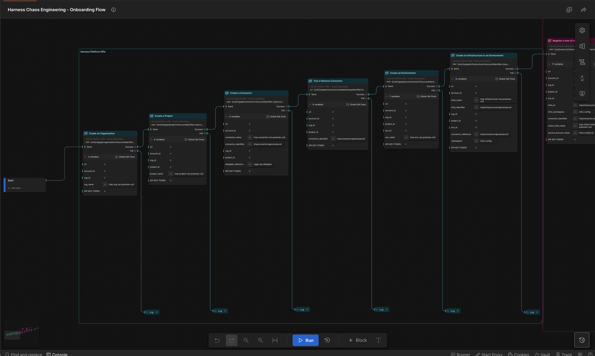
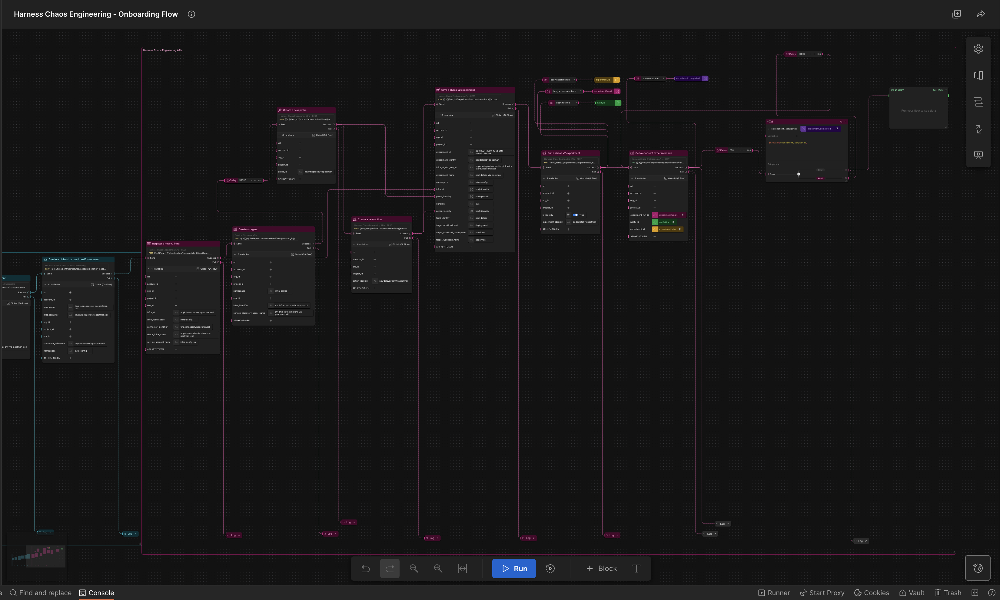

# Flow: [Harness Chaos Engineering - Onboarding Flow]

## Flow Overview

This flow is used to onboard new users to the Harness Chaos Engineering platform.

This flow tries to replicate some of the steps in the [Chaos Onboarding Flow](https://developer.harness.io/docs/chaos-engineering/quickstart#create-your-first-chaos-experiment) that a new user follows to get started with Harness Chaos Engineering through the UI.

_Figure 1: Onboarding Flow Group 1 - Configuring Platform Level Resources_

_Figure 2: Onboarding Flow Group 2 - Configuring Harness Chaos Engineering Resources_

## Flow Link

[View Complete Onboarding Flow in Postman](https://www.postman.com/harness-chaos-engineering/workspace/harness-chaos-engineering-public/flow/691659aa29e6010014b7ddc6)
